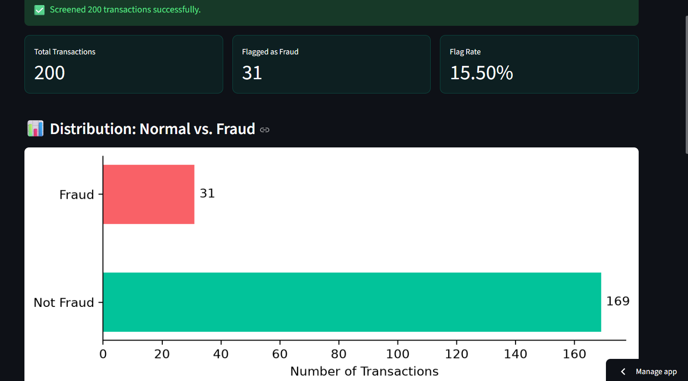
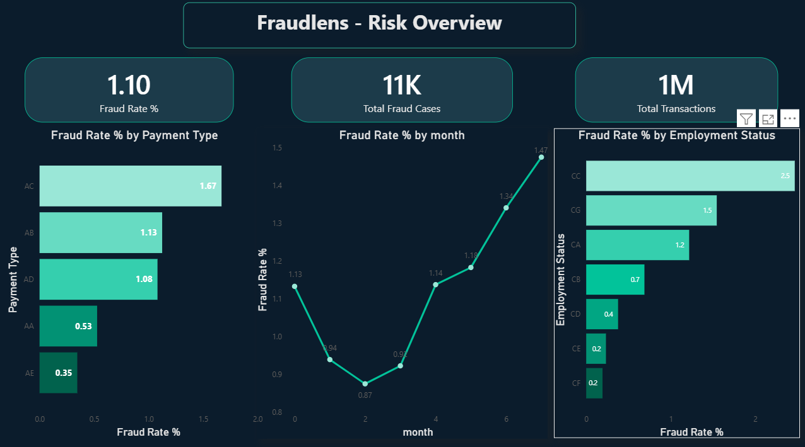

# FraudLens

A two-part fraud detection system: a **Streamlit web app** for transaction-level fraud screening, and a **Power BI report** for business-level fraud trend analysis — both powered by the same trained model and dataset.

Built as a 10-day capstone project for the [#60DayClaudeChallenge](https://www.linkedin.com/) by [@ABTalksOnAI](https://linkedin.com/) and [@AnilBajpai](https://linkedin.com/).

** Live app:** [fraudlens404.streamlit.app](https://fraudlens404.streamlit.app)

---

## Screenshots
| Fraud Analyst View (Streamlit) | Risk Manager View (Power BI) |
|---|---|
|  |  |

 [Watch the Power BI report demo](screenshots/powerbi_demo.mp4)

---

## The Problem

Financial institutions process massive transaction volumes daily, with fraud representing a tiny (~1%) but costly fraction. Manual review doesn't scale, and simple rule-based systems miss evolving patterns. Fraud analysts need fast, batch-level screening; risk managers need aggregated trend visibility. Most tools serve only one of these audiences — FraudLens serves both from one shared model.

##  Features
**Streamlit App (Fraud Analyst View):**
- Upload a CSV of transactions, get instant fraud predictions
- Fraud probability score per transaction
- Distribution chart (normal vs. fraud)
- Top Suspicious Transactions, ranked, with plain-language explanations for each flag
- Full sortable results table

**Power BI Report (Risk Manager View):**
- Overall fraud rate and volume KPIs
- Fraud rate trend over time
- Fraud rate breakdown by payment type and employment status
- Custom DAX measures

## Tech Stack

| Layer | Technology |
|---|---|
| Model | Python, Scikit-learn (Logistic Regression, Random Forest, Isolation Forest) |
| Analyst App | Streamlit |
| Business Report | Power BI Desktop |
| Data | Pandas, NumPy |
| Hosting | Streamlit Community Cloud (free tier) |
| Version Control | Git, GitHub |

**No backend server, no database, no authentication** — by design. See [`docs/ARCHITECTURE.md`](docs/ARCHITECTURE.md) for the full architecture rationale.

## Model Performance

Final model: **Logistic Regression** (`class_weight='balanced'`), selected after comparison against Random Forest and Isolation Forest.

| Metric | Value |
|---|---|
| Recall (Fraud) | 82.3% |
| Precision (Fraud) | 4.5% |
| F1 (Fraud) | 0.086 |

Full model comparison and reasoning in [`model_notes.md`](model_notes.md).

## Running Locally

```bash
git clone https://github.com/uroojey/fraudlens.git
cd fraudlens
python -m venv venv
.\venv\Scripts\Activate.ps1        # Windows
# source venv/bin/activate         # Mac/Linux

pip install -r requirements.txt
python save_imputation_values.py
streamlit run app.py
```

Then open `http://localhost:8501` and upload a CSV from `sample_data/` to try it out.

For the Power BI report: open `powerbi/FraudLens_Report.pbix` in Power BI Desktop (free, no account required to view/edit locally).

## Project Structure

See [`docs/PROJECT-STRUCTURE.md`](docs/PROJECT-STRUCTURE.md) for the full folder breakdown and rationale.

## Documentation

- [Product Requirements Document](FraudLens_PRD.docx)
- [Implementation Blueprint](FraudLens_Implementation_Blueprint.md)
- [Architecture](docs/ARCHITECTURE.md)
- [Data Schema](docs/SCHEMA.md)
- [API/Interface Design](docs/API.md)
- [UI Wireframes](docs/UI-WIREFRAMES.md)

## Data Source & Credit

[Bank Account Fraud Dataset (NeurIPS 2022)](https://www.kaggle.com/datasets/sgpjesus/bank-account-fraud-dataset-neurips-2022), created by **Feedzai**, "Base" variant. Used under its original license terms for educational/portfolio purposes.

## Known Limitations (Intentional Scope, v1.0)

- No user accounts, authentication, or persistent storage
- Batch CSV upload only — no real-time transaction streaming
- Rule-based explanations only — no SHAP/LIME
- Power BI report is a downloadable file + recording, not a live-published dashboard (avoids requiring a Microsoft publishing account)

See the [PRD](FraudLens_PRD.docx) for the complete scope rationale.

## 📄 License

MIT License — see [LICENSE](LICENSE).

## 👤 Author

**Urooj** — [LinkedIn](https://linkedin.com/in/uroojey) · [Portfolio](https://portfolio-uroojey.vercel.app) · [GitHub](https://github.com/uroojey)