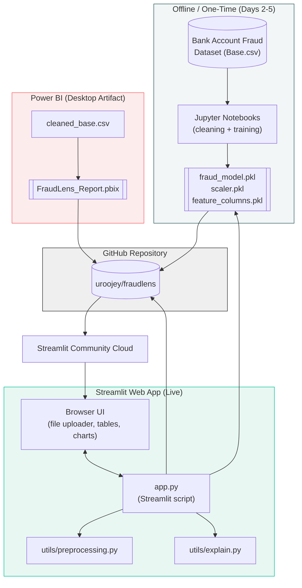
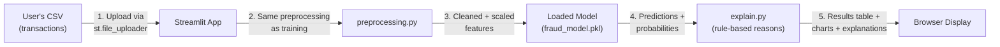
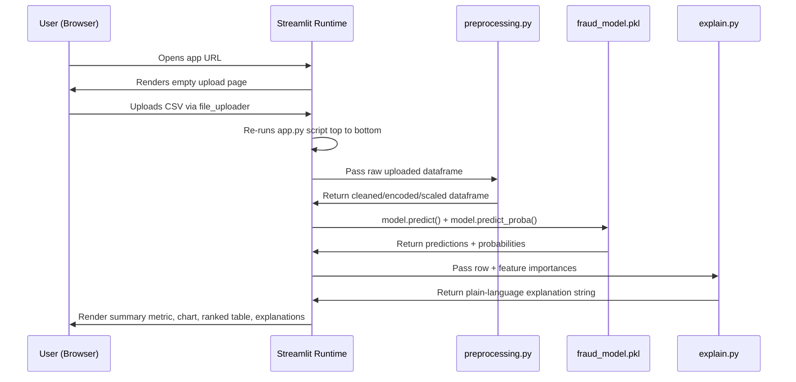
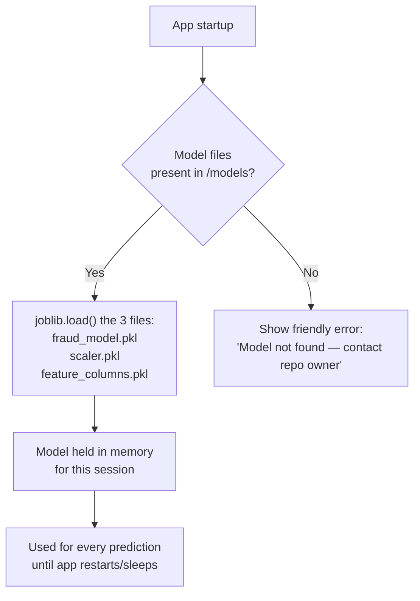

# FraudLens — System Architecture

**Status:** Approved Day 2 design. Source of truth alongside PRD and Implementation Blueprint.
**Scope note:** This is a static-artifact, no-backend architecture. There is no server process handling requests other than Streamlit's own script-rerun model. There is no database. This is intentional per the PRD (no auth, no persistence, no real-time streaming).

---

## 1. Component Diagram

**Key point:** MODEL (the trained model + scaler + feature list) is produced once, offline, in Days 4-5. It is committed to the repo and loaded read-only by the Streamlit app at runtime. It is never retrained inside the live app.

---

## 2. Data Flow

**Critical constraint carried over from the blueprint (Day 6 debugging notes):** step 2 must use the *exact same* preprocessing function used during model training (Day 3/4). This is why `utils/preprocessing.py` is a shared module imported by both the training notebook and `app.py` — not duplicated logic in two places.

---

## 3. Request Lifecycle (Streamlit App)

Streamlit does not have traditional HTTP request/response endpoints — the entire script re-runs top to bottom on every user interaction. This lifecycle replaces a typical "API request" sequence:

Because there's no persistent session on a server beyond Streamlit's own in-memory session state, nothing is saved between visits — this matches the PRD's explicit exclusion of persistence/accounts.

---

## 4. AI/Model Interaction

There is no external AI API call in this project (no LLM, no third-party ML API). "AI interaction" here refers purely to loading a **locally trained Scikit-learn model** at runtime:

## 5. External Services

| Service | Role | Cost | Auth Required? |
|---|---|---|---|
| GitHub | Source control + deployment source | Free | Yes (your existing account) |
| Streamlit Community Cloud | Hosts the live app, auto-redeploys on git push | Free | Sign in with GitHub |
| Power BI Desktop | Builds the report file locally | Free | No (Desktop app itself doesn't require sign-in to build/save a `.pbix`) |
| Kaggle | One-time dataset download | Free | Yes (to download the dataset in Day 2) |

**Note on the Day 2 scope change:** Power BI service (the cloud publish/share step) is **not used** in this architecture, per today's decision to avoid Microsoft account setup. The `.pbix` file is a static artifact stored in the GitHub repo and demonstrated via screen recording, not a live hosted service.
