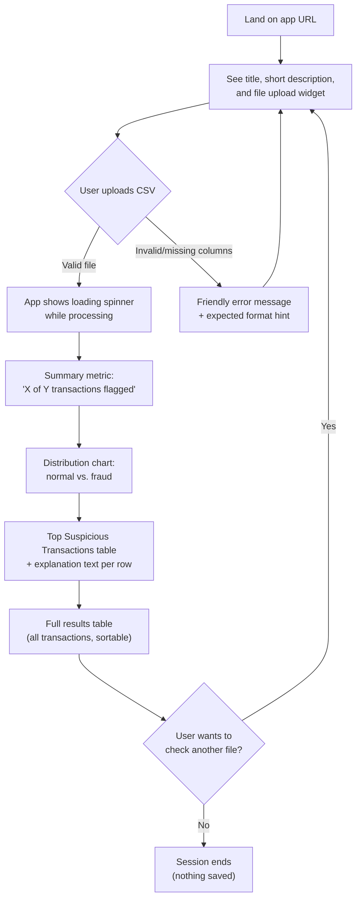
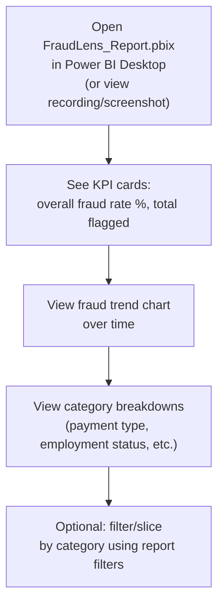

# FraudLens — UI & User Flow

Two separate products, each with its own simple flow. Neither has multiple pages/navigation beyond what's described — this matches the PRD's "no unnecessary scope" constraint, and every screen below exists to satisfy a specific PRD functional requirement.

---

## 1. User Flow Diagram — Streamlit App (Fraud Analyst View)



## 2. User Flow Diagram — Power BI Report (Risk Manager View)



---

## 3. Screen Flow — Streamlit App

Single-page app (no multi-page navigation needed — PRD scope is intentionally one screen doing one job well).

```
┌─────────────────────────────────────────────┐
│  Screen 1: Upload (initial state)            │
├─────────────────────────────────────────────┤
│  Screen 2: Results (after successful upload) │
│    - includes all result sections stacked    │
│      vertically on the same page             │
└─────────────────────────────────────────────┘
```

**Why only one page:** every additional screen is a place for scope to creep and a place a beginner-built app can break. A single vertically-scrolling results page satisfies every PRD functional requirement (FR-1 through FR-6) without navigation complexity.

---

## 4. Wireframe — Streamlit App: Upload State (Screen 1)

```
┌──────────────────────────────────────────────────────┐
│  🔍 FraudLens                                          │
│  Upload a CSV of transactions to screen for fraud      │
│                                                          │
│  ┌────────────────────────────────────────────────┐    │
│  │   📁  Drag and drop file here, or Browse files   │    │
│  │       Limit: .csv                                │    │
│  └────────────────────────────────────────────────┘    │
│                                                          │
│  ────────────────────────────────────────────────────  │
│  SIDEBAR:                                                │
│  ℹ️ About this app                                       │
│  Trained on the Bank Account Fraud dataset (NeurIPS 2022)│
│  🔗 GitHub   🔗 LinkedIn                                 │
└──────────────────────────────────────────────────────┘
```

## 5. Wireframe — Streamlit App: Results State (Screen 2)

```
┌──────────────────────────────────────────────────────┐
│  🔍 FraudLens                                          │
│  Upload a CSV of transactions to screen for fraud      │
│  [ transactions.csv uploaded ✓ ]  [ Upload a new file ]│
│                                                          │
│  ┌─────────────────┐  ┌───────────────────────────┐    │
│  │  🚩 42 of 1,000   │  │   [Bar/Pie Chart]          │    │
│  │  flagged as fraud │  │   Normal ▓▓▓▓▓▓▓▓▓▓ 958   │    │
│  │  (4.2%)           │  │   Fraud  ▓ 42              │    │
│  └─────────────────┘  └───────────────────────────┘    │
│                                                          │
│  🔺 Top Suspicious Transactions                          │
│  ┌────┬──────────┬──────────┬────────────────────────┐ │
│  │ ID │ Amount    │ Prob.    │ Why flagged             │ │
│  ├────┼──────────┼──────────┼────────────────────────┤ │
│  │ 118│ $9,420    │ 94%      │ High amount, new acct   │ │
│  │ 552│ $7,110    │ 89%      │ Unusual device, amount  │ │
│  │ ...│ ...       │ ...      │ ...                     │ │
│  └────┴──────────┴──────────┴────────────────────────┘ │
│                                                          │
│  📋 Full Results Table (sortable, all 1,000 rows)        │
│  [ ... standard dataframe table ... ]                    │
└──────────────────────────────────────────────────────┘
```

---

## 6. Wireframe — Power BI Report (single page)

```
┌──────────────────────────────────────────────────────┐
│  FraudLens — Risk Overview                             │
│                                                          │
│  ┌───────────┐ ┌───────────┐ ┌───────────────────┐    │
│  │ Fraud Rate │ │ Total      │ │ Total Transactions │    │
│  │   4.2%     │ │ Flagged: 42│ │       1,000         │    │
│  └───────────┘ └───────────┘ └───────────────────┘    │
│                                                          │
│  ┌────────────────────────────────────────────────┐    │
│  │   Fraud Rate Over Time (line chart)              │    │
│  └────────────────────────────────────────────────┘    │
│                                                          │
│  ┌───────────────────────┐ ┌─────────────────────┐    │
│  │ Fraud by Payment Type  │ │ Fraud by Employment  │    │
│  │ (bar chart)            │ │ Status (bar chart)   │    │
│  └───────────────────────┘ └─────────────────────┘    │
└──────────────────────────────────────────────────────┘
```

---

## 7. Navigation Summary

| Product | Screens | Navigation |
|---|---|---|
| Streamlit app | 1 (results appear inline below upload, same page) | None needed — vertical scroll only |
| Power BI report | 1 report page | Built-in Power BI filter/slicer interactions only, no custom navigation |

**Why no navigation exists:** Adding multi-page navigation (e.g., a "History" page, a "Settings" page) was considered and explicitly rejected — it would require persistence (a database) to be meaningful, which the PRD excludes. Every screen that exists directly serves a numbered functional requirement in the PRD; nothing is included "because dashboards usually have it."
