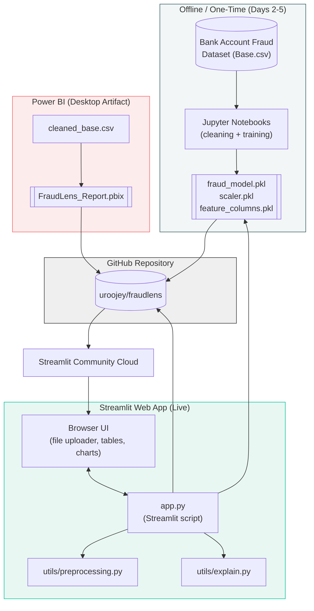
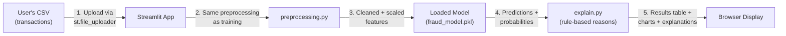
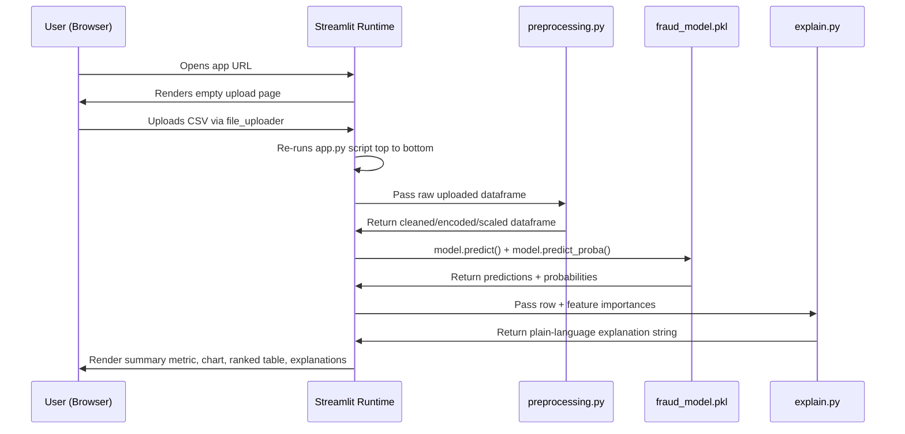
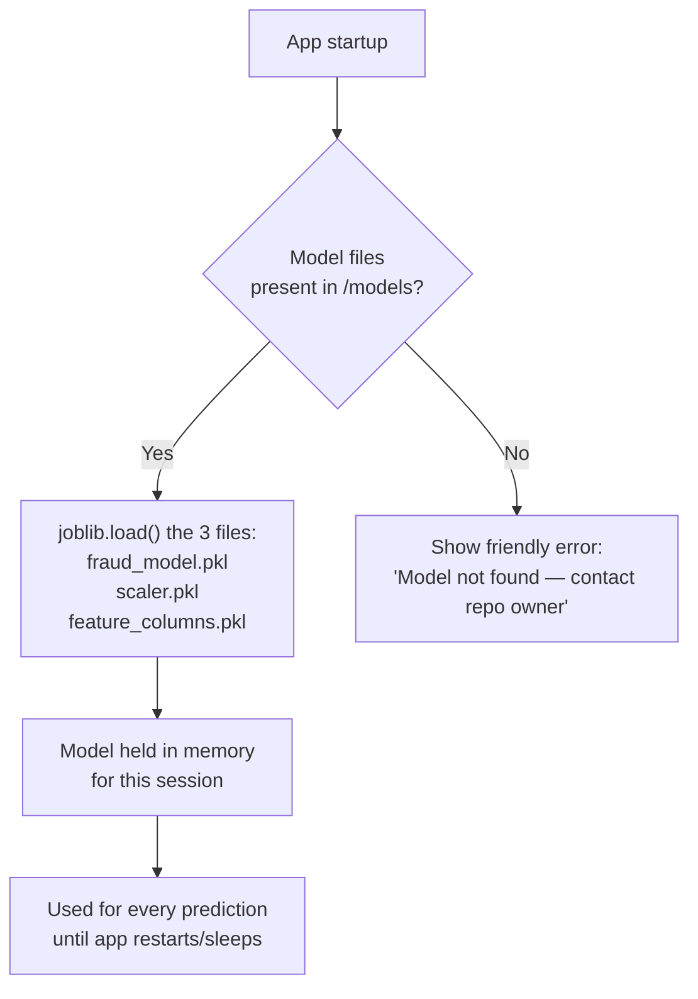
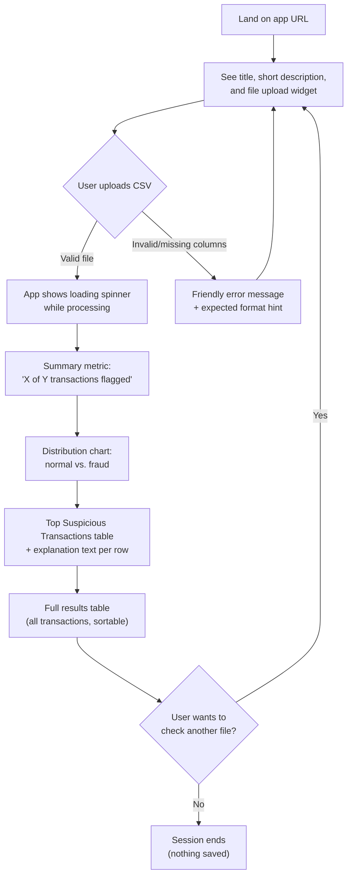
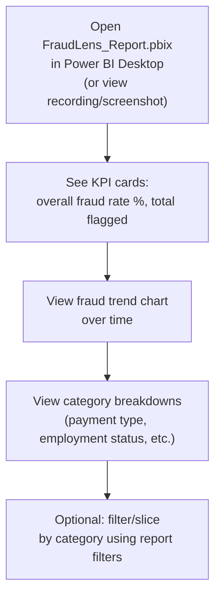

# FraudLens — Design Documentation
Consolidated from the Day 2 system design phase: architecture, data schema, interface design, UI wireframes, and project structure.

---

## 1. Architecture


**Status:** Approved Day 2 design. Source of truth alongside PRD and Implementation Blueprint.
**Scope note:** This is a static-artifact, no-backend architecture. There is no server process handling requests other than Streamlit's own script-rerun model. There is no database. This is intentional per the PRD (no auth, no persistence, no real-time streaming).

---

## 1. Component Diagram



**Key point:** MODEL (the trained model + scaler + feature list) is produced once, offline, in Days 4-5. It is committed to the repo and loaded read-only by the Streamlit app at runtime. It is never retrained inside the live app.

---

## 2. Data Flow



**Critical constraint carried over from the blueprint (Day 6 debugging notes):** step 2 must use the *exact same* preprocessing function used during model training (Day 3/4). This is why `utils/preprocessing.py` is a shared module imported by both the training notebook and `app.py` — not duplicated logic in two places.

---

## 3. Request Lifecycle (Streamlit App)

Streamlit does not have traditional HTTP request/response endpoints — the entire script re-runs top to bottom on every user interaction. This lifecycle replaces a typical "API request" sequence:



Because there's no persistent session on a server beyond Streamlit's own in-memory session state, nothing is saved between visits — this matches the PRD's explicit exclusion of persistence/accounts.

---

## 4. AI/Model Interaction

There is no external AI API call in this project (no LLM, no third-party ML API). "AI interaction" here refers purely to loading a **locally trained Scikit-learn model** at runtime:



## 5. External Services

| Service | Role | Cost | Auth Required? |
|---|---|---|---|
| GitHub | Source control + deployment source | Free | Yes (your existing account) |
| Streamlit Community Cloud | Hosts the live app, auto-redeploys on git push | Free | Sign in with GitHub |
| Power BI Desktop | Builds the report file locally | Free | No (Desktop app itself doesn't require sign-in to build/save a `.pbix`) |
| Kaggle | One-time dataset download | Free | Yes (to download the dataset in Day 2) |

**Note on the Day 2 scope change:** Power BI service (the cloud publish/share step) is **not used** in this architecture, per today's decision to avoid Microsoft account setup. The `.pbix` file is a static artifact stored in the GitHub repo and demonstrated via screen recording, not a live hosted service.
-e 

---

## 2. Data Schema


**Note on scope:** Per the PRD (no auth, no persistence, no user accounts), FraudLens has **no traditional database**. All "storage" is flat files: the dataset CSV, the cleaned CSV, and serialized model artifacts. This document treats those flat files as the schema, since that's the actual persistent data shape in this project.

---

## 1. Raw Dataset — `data/Base.csv`

Source: Bank Account Fraud Dataset (NeurIPS 2022, feedzai), "Base" variant.

| Field (representative subset*) | Type | Description | Constraints |
|---|---|---|---|
| `fraud_bool` | int (0/1) | Target label — 1 if fraudulent | Required. This is the prediction target. |
| `income` | float | Applicant's income bracket (normalized) | May contain `-1` as "missing" placeholder |
| `name_email_similarity` | float | Similarity score between name and email | 0.0–1.0 |
| `customer_age` | int | Applicant age bucket | — |
| `employment_status` | categorical | Employment status code | One-hot encoded in cleaning step |
| `housing_status` | categorical | Housing status code | One-hot encoded in cleaning step |
| `payment_type` | categorical | Payment method used | One-hot encoded in cleaning step |
| `device_os` | categorical | Device operating system | One-hot encoded in cleaning step |
| `month` | int | Simulated month of application | **Flagged in Day 3 blueprint as a potential leakage column — verify before using as a feature** |
| ...remaining columns | numeric/categorical | Per Kaggle data dictionary | Documented per-column in `data_notes.md` during Day 2 |

*Full column list (~30 columns) is documented in `data_notes.md` once the dataset is downloaded in today's remaining Day 2 work — this table will be completed then, not invented today, since the PRD requires validating actual data, not assumed structure.

**Validation rule:** every column used as a model feature must be confirmed as "known at prediction time" — i.e., not derived from information only available after a fraud determination is made. This is checked during Day 3 cleaning.

---

## 2. Cleaned Dataset — `data/cleaned_base.csv`

Same row structure as `Base.csv`, transformed as follows:

| Transformation | Applied To | Rule |
|---|---|---|
| Missing value handling | Columns using `-1` as missing placeholder | Impute or flag-as-category per column (decided in Day 3, documented in `data_notes.md`) |
| One-hot encoding | All categorical columns (`payment_type`, `employment_status`, `housing_status`, `device_os`, etc.) | Expands each category into binary columns |
| Leakage column removal | `month` (if confirmed as leakage) | Dropped entirely if not safe to use |
| Target isolation | `fraud_bool` | Kept separate as `y`; not scaled |

**Constraint:** `cleaned_base.csv` must have zero null values and be 100% numeric (verified in Day 3 testing tasks) — this is what makes it "model-ready."

---

## 3. Model Artifacts — `models/`

These three files together form the "schema" the Streamlit app depends on. All three must be saved together and stay in sync — this is the #1 architectural risk flagged in the blueprint (Day 6 debugging notes).

| File | Contents | Produced By | Consumed By |
|---|---|---|---|
| `fraud_model.pkl` | Trained classifier object (Logistic Regression or Random Forest, whichever wins evaluation) | Day 5 notebook | `app.py` |
| `scaler.pkl` | Fitted `StandardScaler` object (fit only on training data) | Day 4-5 notebook | `app.py` (applied to new uploads before prediction) |
| `feature_columns.pkl` | Ordered list of column names the model expects, post-encoding | Day 5 notebook | `app.py` (used to validate/align uploaded CSV columns) |

**Constraint validated in Day 6 testing:** reloading these three files in a fresh session and predicting on a held-out sample must produce identical results to the original notebook evaluation. If not, the artifacts are out of sync and must be re-saved together.

---

## 4. Runtime Input — User-Uploaded CSV (Streamlit)

This is not stored anywhere — it exists only in memory during a single browser session.

| Requirement | Rule |
|---|---|
| Required columns | Must match `feature_columns.pkl` (pre-encoding raw columns) |
| Row limit | No hard limit for v1.0, but very large files may be slow — acceptable per PRD (no real-time/streaming requirement) |
| Validation | If required columns are missing, app shows a friendly error rather than crashing (Day 6 requirement) |
| Persistence | None — data is discarded when the browser tab closes or a new file is uploaded |

---

## 5. Power BI Data Source

The `.pbix` file (built in Power BI Desktop, Day 8-9) imports `cleaned_base.csv` directly as a static import (not a live/scheduled refresh connection), since there's no hosted database to connect to. This is consistent with the "Desktop artifact, not live service" decision made today.

---

## 6. Schema Validation Against PRD User Stories

| PRD Requirement | Schema Support |
|---|---|
| FR-1: Upload CSV of transactions | Runtime input schema (Section 4) supports this |
| FR-2: Fraud prediction + probability per transaction | Model artifacts (Section 3) directly enable this |
| FR-6: Plain-language explanation using feature importance | Requires `fraud_model.pkl` to expose `.feature_importances_` (Random Forest) or `.coef_` (Logistic Regression) — both supported by the chosen algorithms |
| FR-7/FR-8: Power BI trend/category visuals + DAX measure | `cleaned_base.csv` (Section 2) has the categorical + target columns needed |

No PRD requirement needs data storage beyond what's listed above — confirms no database is needed for v1.0.
-e 

---

## 3. API / Interface Design


**Important scope note:** FraudLens has **no REST/HTTP backend** — this was confirmed in today's tech stack decision (Streamlit runs the model in-process; no separate server). So there are no traditional client-server "endpoints" in the conventional sense.

To still satisfy the PRD's need for defined, testable interfaces before implementation, this document specifies the **internal function-level contracts** that `app.py` relies on. These behave like an API in every practical sense (defined inputs, outputs, validation, and error cases) — they're just Python function calls instead of HTTP calls. This keeps Day 6 implementation unambiguous, which is the actual goal of this section.

If a future version adds a real API (see PRD Section 12, Future Scope), these same contracts would translate almost directly into REST endpoints — noted per function below.

---

## Function 1: `preprocess_transactions(df: pd.DataFrame) -> pd.DataFrame`

**Purpose:** Transform a raw uploaded CSV into the exact cleaned/encoded/scaled format the model expects. This is the single most important function in the app — it must exactly mirror the Day 3 training-time cleaning logic.

**Location:** `utils/preprocessing.py`

**Input:**
- `df`: raw Pandas DataFrame from the uploaded CSV, with the original (pre-encoding) column names

**Output:**
- Cleaned, encoded, scaled Pandas DataFrame, columns aligned to `feature_columns.pkl`

**Validation:**
- Confirms all required raw columns are present (compares against a known required-columns list)
- Confirms no unexpected data types (e.g., text in a numeric column) that would break scaling

**Error cases:**
| Case | Behavior |
|---|---|
| Missing required column(s) | Raise a caught exception with a friendly message: "Your file is missing column(s): X, Y — please check the expected format." |
| Empty file / zero rows | Friendly message: "The uploaded file has no data." |
| Non-CSV file uploaded | Streamlit's `file_uploader` type filter prevents this at the UI level (accept only `.csv`) |

**Future REST equivalent:** `POST /api/preprocess` — body: raw CSV; response: cleaned feature array or 400 error

---

## Function 2: `predict_fraud(features: pd.DataFrame, model, scaler) -> pd.DataFrame`

**Purpose:** Run the loaded model on preprocessed data and return predictions + probabilities.

**Location:** `app.py` (or a small `utils/predict.py` if it grows — decide during implementation, not today)

**Input:**
- `features`: output of `preprocess_transactions()`
- `model`: loaded `fraud_model.pkl` object
- `scaler`: loaded `scaler.pkl` object (applied inside this function if not already applied)

**Output:**
- Original dataframe plus two new columns: `fraud_prediction` (Fraud / Not Fraud) and `fraud_probability` (0–100%)

**Validation:**
- Confirms `features` column order matches what the model was trained on (via `feature_columns.pkl`)

**Error cases:**
| Case | Behavior |
|---|---|
| Column order/shape mismatch with trained model | Friendly message: "Something went wrong scoring this file — please contact the repo owner," logged internally for debugging |
| Model file missing/corrupted at startup | App shows a startup error banner instead of crashing silently |

**Future REST equivalent:** `POST /api/predict` — body: cleaned feature array; response: predictions + probabilities array or 500 error

---

## Function 3: `explain_flagged_transaction(row: pd.Series, feature_importances: dict) -> str`

**Purpose:** Produce a simple, plain-language reason for why a transaction was flagged, using the top 2-3 most important features present in that row.

**Location:** `utils/explain.py`

**Input:**
- `row`: a single transaction's data (post-prediction)
- `feature_importances`: precomputed dict of feature name → importance score (from the trained model, generated once in Day 5, saved alongside the model)

**Output:**
- A short string, e.g.: `"Flagged mainly due to unusually high transaction amount and new account age."`

**Validation:**
- Confirms `feature_importances` is non-empty
- Skips explanation generation entirely for non-flagged (predicted-clean) rows — this function is only called for the "Top Suspicious Transactions" view (per PRD FR-6)

**Error cases:**
| Case | Behavior |
|---|---|
| Row has no strong feature signal (all importances near zero) | Falls back to generic text: "Flagged by the model's overall risk score." |

**Future REST equivalent:** `GET /api/explain/{transaction_id}` — response: explanation string

---

## Function 4: `load_model_artifacts() -> tuple(model, scaler, feature_columns)`

**Purpose:** Load the three saved model files once at app startup (not on every prediction, for performance).

**Location:** `app.py` (top-level, using Streamlit's `@st.cache_resource` decorator so it only runs once per app instance)

**Input:** None (reads from fixed paths in `models/`)

**Output:** the three loaded objects

**Error cases:**
| Case | Behavior |
|---|---|
| Any of the 3 files missing | App shows a clear startup error: "Model files not found — this app cannot make predictions right now." rather than a raw Python traceback |

**Future REST equivalent:** N/A — this is a startup/initialization concern, not a per-request endpoint

---

## Summary Table — All Interfaces at a Glance

| Function | Purpose | Called When |
|---|---|---|
| `preprocess_transactions()` | Clean/encode/scale uploaded CSV | Every file upload |
| `predict_fraud()` | Run model, get predictions | Immediately after preprocessing |
| `explain_flagged_transaction()` | Plain-language reason for a flag | For each row shown in "Top Suspicious Transactions" |
| `load_model_artifacts()` | Load model/scaler/columns from disk | Once, at app startup |

No authentication is applied to any of these — consistent with the PRD's explicit exclusion of user accounts/auth for v1.0.
-e 

---

## 4. UI & User Flow


Two separate products, each with its own simple flow. Neither has multiple pages/navigation beyond what's described — this matches the PRD's "no unnecessary scope" constraint, and every screen below exists to satisfy a specific PRD functional requirement.

---

## 1. User Flow Diagram — Streamlit App (Fraud Analyst View)



## 2. User Flow Diagram — Power BI Report (Risk Manager View)



---

## 3. Screen Flow — Streamlit App

Single-page app (no multi-page navigation needed — PRD scope is intentionally one screen doing one job well).

```
┌─────────────────────────────────────────────┐
│  Screen 1: Upload (initial state)            │
├─────────────────────────────────────────────┤
│  Screen 2: Results (after successful upload) │
│    - includes all result sections stacked    │
│      vertically on the same page             │
└─────────────────────────────────────────────┘
```

**Why only one page:** every additional screen is a place for scope to creep and a place a beginner-built app can break. A single vertically-scrolling results page satisfies every PRD functional requirement (FR-1 through FR-6) without navigation complexity.

---

## 4. Wireframe — Streamlit App: Upload State (Screen 1)

```
┌──────────────────────────────────────────────────────┐
│  🔍 FraudLens                                          │
│  Upload a CSV of transactions to screen for fraud      │
│                                                          │
│  ┌────────────────────────────────────────────────┐    │
│  │   📁  Drag and drop file here, or Browse files   │    │
│  │       Limit: .csv                                │    │
│  └────────────────────────────────────────────────┘    │
│                                                          │
│  ────────────────────────────────────────────────────  │
│  SIDEBAR:                                                │
│  ℹ️ About this app                                       │
│  Trained on the Bank Account Fraud dataset (NeurIPS 2022)│
│  🔗 GitHub   🔗 LinkedIn                                 │
└──────────────────────────────────────────────────────┘
```

## 5. Wireframe — Streamlit App: Results State (Screen 2)

```
┌──────────────────────────────────────────────────────┐
│  🔍 FraudLens                                          │
│  Upload a CSV of transactions to screen for fraud      │
│  [ transactions.csv uploaded ✓ ]  [ Upload a new file ]│
│                                                          │
│  ┌─────────────────┐  ┌───────────────────────────┐    │
│  │  🚩 42 of 1,000   │  │   [Bar/Pie Chart]          │    │
│  │  flagged as fraud │  │   Normal ▓▓▓▓▓▓▓▓▓▓ 958   │    │
│  │  (4.2%)           │  │   Fraud  ▓ 42              │    │
│  └─────────────────┘  └───────────────────────────┘    │
│                                                          │
│  🔺 Top Suspicious Transactions                          │
│  ┌────┬──────────┬──────────┬────────────────────────┐ │
│  │ ID │ Amount    │ Prob.    │ Why flagged             │ │
│  ├────┼──────────┼──────────┼────────────────────────┤ │
│  │ 118│ $9,420    │ 94%      │ High amount, new acct   │ │
│  │ 552│ $7,110    │ 89%      │ Unusual device, amount  │ │
│  │ ...│ ...       │ ...      │ ...                     │ │
│  └────┴──────────┴──────────┴────────────────────────┘ │
│                                                          │
│  📋 Full Results Table (sortable, all 1,000 rows)        │
│  [ ... standard dataframe table ... ]                    │
└──────────────────────────────────────────────────────┘
```

---

## 6. Wireframe — Power BI Report (single page)

```
┌──────────────────────────────────────────────────────┐
│  FraudLens — Risk Overview                             │
│                                                          │
│  ┌───────────┐ ┌───────────┐ ┌───────────────────┐    │
│  │ Fraud Rate │ │ Total      │ │ Total Transactions │    │
│  │   4.2%     │ │ Flagged: 42│ │       1,000         │    │
│  └───────────┘ └───────────┘ └───────────────────┘    │
│                                                          │
│  ┌────────────────────────────────────────────────┐    │
│  │   Fraud Rate Over Time (line chart)              │    │
│  └────────────────────────────────────────────────┘    │
│                                                          │
│  ┌───────────────────────┐ ┌─────────────────────┐    │
│  │ Fraud by Payment Type  │ │ Fraud by Employment  │    │
│  │ (bar chart)            │ │ Status (bar chart)   │    │
│  └───────────────────────┘ └─────────────────────┘    │
└──────────────────────────────────────────────────────┘
```

---

## 7. Navigation Summary

| Product | Screens | Navigation |
|---|---|---|
| Streamlit app | 1 (results appear inline below upload, same page) | None needed — vertical scroll only |
| Power BI report | 1 report page | Built-in Power BI filter/slicer interactions only, no custom navigation |

**Why no navigation exists:** Adding multi-page navigation (e.g., a "History" page, a "Settings" page) was considered and explicitly rejected — it would require persistence (a database) to be meaningful, which the PRD excludes. Every screen that exists directly serves a numbered functional requirement in the PRD; nothing is included "because dashboards usually have it."
-e 

---

## 5. Project Structure


This matches the folder skeleton already created locally today, with additions for where future code/docs will live.

```
fraudlens/
├── data/
│   ├── Base.csv                     # Raw dataset (Day 2) — gitignored if large
│   └── cleaned_base.csv             # Cleaned/encoded dataset (Day 3)
│
├── notebooks/
│   ├── 01_data_exploration.ipynb    # Day 2 — first-pass EDA
│   ├── 02_data_cleaning.ipynb       # Day 3 — cleaning/encoding pipeline
│   └── 03_modeling.ipynb            # Days 4-5 — training, evaluation, model selection
│
├── models/
│   ├── fraud_model.pkl              # Day 5 — final trained classifier
│   ├── scaler.pkl                   # Day 5 — fitted StandardScaler
│   └── feature_columns.pkl          # Day 5 — expected column order/list
│
├── utils/
│   ├── preprocessing.py             # Day 6 — shared cleaning fn (notebook + app both import this)
│   └── explain.py                   # Day 7 — rule-based explanation helper
│
├── sample_data/
│   └── sample_transactions.csv      # Day 6 — small held-out sample for local testing/demoing
│
├── powerbi/
│   └── FraudLens_Report.pbix        # Days 8-9 — Power BI Desktop report file
│
├── screenshots/                     # Day 10 — final demo screenshots for README/LinkedIn
│
├── docs/                            # NEW today — houses all Day 2 design docs
│   ├── ARCHITECTURE.md
│   ├── SCHEMA.md
│   ├── API.md
│   ├── UI-WIREFRAMES.md
│   └── PROJECT-STRUCTURE.md (this file)
│
├── app.py                           # Day 6-7 — the Streamlit app entry point
├── requirements.txt                 # Day 8 — exact package versions for deployment
├── data_notes.md                    # Day 2-3 — dataset + cleaning decisions log
├── model_notes.md                   # Days 4-5 — model comparison + final choice log
├── PROJECT_LOG.md                   # NEW today — running daily log across the whole capstone
├── .gitignore                       # Already created (Python template)
└── README.md                        # Already created — expanded fully on Day 10
```

## Rationale for Key Decisions

**`docs/` folder (new today):** Keeps all planning/design documentation separate from working code and data, so the repo reads cleanly to anyone browsing it (recruiters included) — code and docs don't get mixed together in the root.

**`utils/` as shared logic:** `preprocessing.py` is imported by both `notebooks/03_modeling.ipynb` (during training) and `app.py` (during live prediction). This single-source-of-truth pattern directly prevents the #1 architectural risk flagged in both `ARCHITECTURE.md` and `SCHEMA.md` — training/serving mismatch.

**`models/` as three files together, not one:** the model, scaler, and feature list are versioned and saved as a set. If any one changes, all three should be re-saved together — this is called out explicitly in the Day 5-6 blueprint sections and in `SCHEMA.md`.

**No `backend/` or `api/` folder:** Consistent with today's tech stack decision — there is no separate backend server, so no folder is created to imply one exists.

**No `database/` or `migrations/` folder:** Consistent with the PRD's exclusion of persistent storage.

**`powerbi/` as its own top-level folder:** Keeps the Power BI artifact clearly separated from the Python side of the project, since it's built and maintained by a completely different tool (Power BI Desktop, not code).

**`PROJECT_LOG.md` (new today):** A running day-by-day log (separate from the detailed `dayN.md` LinkedIn/documentation files you already produce) — this one is purely internal, short-form, and answers "what happened each day and what changed" for quick reference across the whole 10-day arc.

## Where Future Code Will Live (quick reference for Days 3-10)

| Day | New files created |
|---|---|
| 2 | `data/Base.csv`, `notebooks/01_data_exploration.ipynb`, `data_notes.md` |
| 3 | `notebooks/02_data_cleaning.ipynb`, `data/cleaned_base.csv` |
| 4 | `notebooks/03_modeling.ipynb` (baseline model), `model_notes.md` |
| 5 | `notebooks/03_modeling.ipynb` (final model), `models/*.pkl` (all 3) |
| 6 | `app.py` (core), `utils/preprocessing.py`, `sample_data/sample_transactions.csv` |
| 7 | `app.py` (polish), `utils/explain.py` |
| 8 | `requirements.txt`, `powerbi/FraudLens_Report.pbix` (draft) |
| 9 | `powerbi/FraudLens_Report.pbix` (final) |
| 10 | `README.md` (final), `screenshots/*`, final `PROJECT_LOG.md` entry |